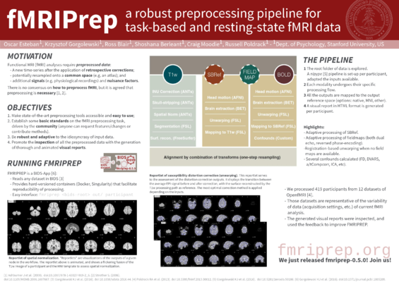

.. include:: links.rst

.. _citation:

===============
Citing FMRIPREP
===============

Select which options you have run FMRIPREP with to generate custom language
we recommend to include in your paper.

.. raw:: html

   
   

   With Freesurfer: <input id="freesurfer" type="checkbox" checked="true" onclick="toggle();"/> 
   Suceptibility Distortion Correction: <select id="SDC" onclick="toggle();">
     <option value="none" selected="true">none</option>
     <option value="TOPUP">TOPUP</option>
     <option value="FUGUE">FUGUE</option>
     <option value="SyN">SyN</option>
   </select> 
   With AROMA: <input id="AROMA" type="checkbox" onclick="toggle();"/> 
   Skullstrip template: <select id="ss_template" onclick="toggle();">
     <option value="OASIS" selected="true">OASIS</option>
     <option value="NKI">NKI</option>
   </select> 
   With slicetime correction: <input id="slicetime" type="checkbox" checked="true" onclick="toggle();"/> 
   

   
Results included in this manuscript come from preprocessing performed using FMRIPREP version latest [1] a Nipype [2,3] based tool. Each T1 weighted volume was corrected for bias field using N4BiasFieldCorrection v2.1.0 [4] and skullstripped using antsBrainExtraction.sh v2.1.0 (using
   OASIS
   NKI
   template).
   Cortical surface was estimated using FreeSurfer v6.0.0 [5]. 
   The skullstripped T1w volume was coregistered to skullstripped ICBM 152 Nonlinear Asymmetrical template version 2009c [6] using nonlinear transformation implemented in ANTs v2.1.0 [7].

  
Functional data was slice time corrected using AFNI [10] and motion corrected using MCFLIRT v5.0.9 [8].
  Distortion correction was performed using an implementation of the TOPUP technique [9] using 3dQwarp v16.2.07 distributed as part of AFNI [10]. 
  Distortion correction was performed using fieldmaps processed by the FUGUE v5.0.9 [11] tool. 
  Distortion correction was performed by estimating ANTs based nonlinear coregistration of the functional image to intensity inverted T1w image [12,13] constrained with an average fieldmap template [14].
  This was followed by coregistration to the corresponding T1 weighted volume using boundary based registration 9 degrees of freedom - implemented in
  FreeSurfer v6.0.0 [15]
  FSL [15]
  . Motion correcting transformations,
  field distortion correcting warp, 
  field distortion correcting warp, 
  field distortion correcting warp, 
  T1 weighted transformation and MNI template warp were applied in a single step using antsApplyTransformations v2.1.0 with Lanczos interpolation.
  

  

  Three tissue classes were extracted from T1w images using FSL FAST v5.0.9 [16]. Voxels from cerebrospinal fluid and white matter were used to create a mask in turn used to extract physiological noise regressors using aCompCor [17]. Mask was eroded and limited to subcortical regions to limit overlap with grey matter, six principal components were estimated. Framewise displacement [18] was calculated for each functional run using Nipype implementation. ICA-based Automatic Removal Of Motion Artifacts (AROMA) was used to generate aggressive noise regressors as well as creating a variant of data that was non-aggressively denoised [19].

  

  For more details of the pipeline see <a id="workflow_url" href="http://fmriprep.readthedocs.io/en/latest/workflows.html">http://fmriprep.readthedocs.io/en/latest/workflows.html</a>.
  

  

  FMRIPREP Available from: <a id="fmriprep_doi_url" href="https://doi.org/10.5281/zenodo.852659">https://doi.org/10.5281/zenodo.852659</a>
  
  

  

  2. 	Gorgolewski K, Burns CD, Madison C, Clark D, Halchenko YO, Waskom ML, Ghosh SS. Nipype: a flexible, lightweight and extensible neuroimaging data processing framework in python. Front Neuroinform [Internet]. 2011 Aug 22;5(August):13. Available from: <a href="http://dx.doi.org/10.3389/fninf.2011.00013">http://dx.doi.org/10.3389/fninf.2011.00013</a>
  

  

  3. 	Gorgolewski KJ, Esteban O, Ellis DG, Notter MP, Ziegler E, Johnson H, Hamalainen C, Yvernault B, Burns C, Manhães-Savio A, Jarecka D, Markiewicz CJ, Salo T, Clark D, Waskom M, Wong J, Modat M, Dewey BE, Clark MG, Dayan M, Loney F, Madison C, Gramfort A, Keshavan A, Berleant S, Pinsard B, Goncalves M, Clark D, Cipollini B, Varoquaux G, Wassermann D, Rokem A, Halchenko YO, Forbes J, Moloney B, Malone IB, Hanke M, Mordom D, Buchanan C, Pauli WM, Huntenburg JM, Horea C, Schwartz Y, Tungaraza R, Iqbal S, Kleesiek J, Sikka S, Frohlich C, Kent J, Perez-Guevara M, Watanabe A, Welch D, Cumba C, Ginsburg D, Eshaghi A, Kastman E, Bougacha S, Blair R, Acland B, Gillman A, Schaefer A, Nichols BN, Giavasis S, Erickson D, Correa C, Ghayoor A, Küttner R, Haselgrove C, Zhou D, Craddock RC, Haehn D, Lampe L, Millman J, Lai J, Renfro M, Liu S, Stadler J, Glatard T, Kahn AE, Kong X-Z, Triplett W, Park A, McDermottroe C, Hallquist M, Poldrack R, Perkins LN, Noel M, Gerhard S, Salvatore J, Mertz F, Broderick W, Inati S, Hinds O, Brett M, Durnez J, Tambini A, Rothmei S, Andberg SK, Cooper G, Marina A, Mattfeld A, Urchs S, Sharp P, Matsubara K, Geisler D, Cheung B, Floren A, Nickson T, Pannetier N, Weinstein A, Dubois M, Arias J, Tarbert C, Schlamp K, Jordan K, Liem F, Saase V, Harms R, Khanuja R, Podranski K, Flandin G, Papadopoulos Orfanos D, Schwabacher I, McNamee D, Falkiewicz M, Pellman J, Linkersdörfer J, Varada J, Pérez-García F, Davison A, Shachnev D, Ghosh S. Nipype: a flexible, lightweight and extensible neuroimaging data processing framework in Python [Internet]. 2017. Available from: <a href="https://doi.org/10.5281/zenodo.581704">https://doi.org/10.5281/zenodo.581704</a>
  

  

  4. 	Tustison NJ, Avants BB, Cook PA, Zheng Y, Egan A, Yushkevich PA, Gee JC. N4ITK: improved N3 bias correction. IEEE Trans Med Imaging [Internet]. 2010 Jun;29(6):1310–20. Available from: <a href="http://dx.doi.org/10.1109/TMI.2010.2046908">http://dx.doi.org/10.1109/TMI.2010.2046908</a>
  

  

  5. 	Dale A, Fischl B, Sereno MI. Cortical Surface-Based Analysis: I. Segmentation and Surface Reconstruction. Neuroimage. 1999;9(2):179–94.
  

  

  6. 	Fonov VS, Evans AC, McKinstry RC, Almli CR, Collins DL. Unbiased nonlinear average age-appropriate brain templates from birth to adulthood. NeuroImage; Amsterdam [Internet]. 2009 Jul 1;47:S102. Available from: <a href="https://search.proquest.com/docview/1833173019">https://search.proquest.com/docview/1833173019</a>
  

  

  7. 	Avants BB, Epstein CL, Grossman M, Gee JC. Symmetric diffeomorphic image registration with cross-correlation: evaluating automated labeling of elderly and neurodegenerative brain. Med Image Anal [Internet]. 2008 Feb;12(1):26–41. Available from: <a href="http://dx.doi.org/10.1016/j.media.2007.06.004">http://dx.doi.org/10.1016/j.media.2007.06.004</a>
  

  

  8. 	Jenkinson M, Bannister P, Brady M, Smith S. Improved optimization for the robust and accurate linear registration and motion correction of brain images. Neuroimage [Internet]. 2002 Oct;17(2):825–41. Available from: <a href="https://www.ncbi.nlm.nih.gov/pubmed/12377157">https://www.ncbi.nlm.nih.gov/pubmed/12377157</a>
  

  

  9. 	Andersson JLR, Skare S, Ashburner J. How to correct susceptibility distortions in spin-echo echo-planar images: application to diffusion tensor imaging. Neuroimage [Internet]. 2003 Oct;20(2):870–88. Available from: <a href="http://dx.doi.org/10.1016/S1053-8119(03)00336-7">http://dx.doi.org/10.1016/S1053-8119(03)00336-7</a>
  

  

  10. 	Cox RW. AFNI: software for analysis and visualization of functional magnetic resonance neuroimages. Comput Biomed Res [Internet]. 1996 Jun;29(3):162–73. Available from: <a href="http://www.ncbi.nlm.nih.gov/pubmed/8812068">http://www.ncbi.nlm.nih.gov/pubmed/8812068</a>
  

  

  11. 	Jenkinson M. Fast, automated, N-dimensional phase-unwrapping algorithm. Magn Reson Med [Internet]. 2003 Jan;49(1):193–7. Available from: <a href="http://dx.doi.org/10.1002/mrm.10354">http://dx.doi.org/10.1002/mrm.10354</a>
  

  

  12. 	Huntenburg JM. Evaluating nonlinear coregistration of BOLD EPI and T1w images [Internet]. Freie Universität Berlin; 2014. Available from: <a href="http://pubman.mpdl.mpg.de/pubman/item/escidoc:2327525/component/escidoc:2327523/master_thesis_huntenburg_4686947.pdf">http://pubman.mpdl.mpg.de/pubman/item/escidoc:2327525/component/escidoc:2327523/master_thesis_huntenburg_4686947.pdf</a>
  

  

  13. 	Wang S, Peterson DJ, Gatenby JC, Li W, Grabowski TJ, Madhyastha TM. Evaluation of Field Map and Nonlinear Registration Methods for Correction of Susceptibility Artifacts in Diffusion MRI. Front Neuroinform [Internet]. 2017 [cited 2017 Feb 21];11. Available from: <a href="http://journal.frontiersin.org/article/10.3389/fninf.2017.00017/full">http://journal.frontiersin.org/article/10.3389/fninf.2017.00017/full</a>
  

  

  14. 	Treiber JM, White NS, Steed TC, Bartsch H, Holland D, Farid N, McDonald CR, Carter BS, Dale AM, Chen CC. Characterization and Correction of Geometric Distortions in 814 Diffusion Weighted Images. PLoS One [Internet]. 2016 Mar 30;11(3):e0152472. Available from: <a href="http://dx.doi.org/10.1371/journal.pone.0152472">http://dx.doi.org/10.1371/journal.pone.0152472</a>
  

  

  15. 	Greve DN, Fischl B. Accurate and robust brain image alignment using boundary-based registration. Neuroimage [Internet]. 2009 Oct;48(1):63–72. Available from: <a href="http://dx.doi.org/10.1016/j.neuroimage.2009.06.060">http://dx.doi.org/10.1016/j.neuroimage.2009.06.060</a>
  

  

  16. 	Zhang Y, Brady M, Smith S. Segmentation of brain MR images through a hidden Markov random field model and the expectation-maximization algorithm. IEEE Trans Med Imaging [Internet]. 2001 Jan;20(1):45–57. Available from: <a href="http://dx.doi.org/10.1109/42.906424">http://dx.doi.org/10.1109/42.906424</a>
  

  

  17. 	Behzadi Y, Restom K, Liau J, Liu TT. A component based noise correction method (CompCor) for BOLD and perfusion based fMRI. Neuroimage [Internet]. 2007 Aug 1;37(1):90–101. Available from: <a href="http://dx.doi.org/10.1109/42.906424">http://dx.doi.org/10.1016/j.neuroimage.2007.04.042</a>
  

  

  18. 	Power JD, Mitra A, Laumann TO, Snyder AZ, Schlaggar BL, Petersen SE. Methods to detect, characterize, and remove motion artifact in resting state fMRI. Neuroimage [Internet]. 2013 Aug 29;84:320–41. Available from: <a href="http://dx.doi.org/10.1016/j.neuroimage.2013.08.048">http://dx.doi.org/10.1016/j.neuroimage.2013.08.048</a>
  

  

  19. 	Pruim RHR, Mennes M, van Rooij D, Llera A, Buitelaar JK, Beckmann CF. ICA-AROMA: A robust ICA-based strategy for removing motion artifacts from fMRI data. Neuroimage [Internet]. 2015 May 15;112:267–77. Available from: <a href="http://dx.doi.org/10.1016/j.neuroimage.2015.02.064">http://dx.doi.org/10.1016/j.neuroimage.2015.02.064</a>
  

Posters
-------

* Organization for Human Brain Mapping 2017 (`pdf <https://f1000research.com/posters/6-1129>`_)

.. include:: license.rst
