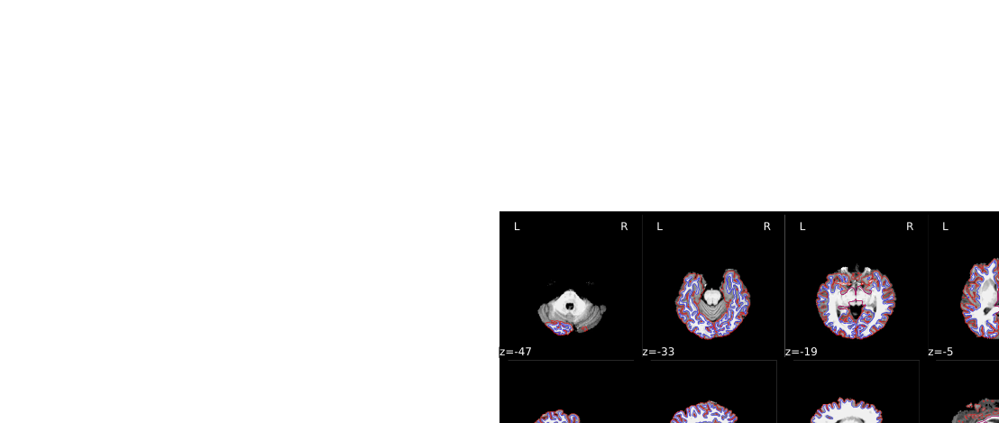
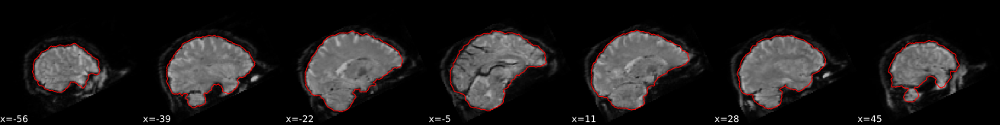

.. include:: links.rst

===========================
Processing pipeline details
===========================

``fmriprep`` adapts its pipeline depending on what data and metadata is
available is used as the input. For example, slice timing correction will be
performed only if the ``SliceTiming`` metadata field is found for the input
dataset.

High-level view of the basic pipeline (for single-band datasets, without
slice-timing information and no fieldmap acquisitions):

.. workflow::
    :graph2use: orig
    :simple_form: yes

    from fmriprep.workflows.base import init_single_subject_wf
    wf = init_single_subject_wf(subject_id='test',
                                name='single_subject_wf',
                                task_id='',
                                longitudinal=False,
                                omp_nthreads=1,
                                freesurfer=True,
                                reportlets_dir='.',
                                output_dir='.',
                                bids_dir='.',
                                skull_strip_ants=True,
                                template='MNI152NLin2009cAsym',
                                output_spaces=['T1w', 'fsnative',
                                              'template', 'fsaverage5'],
                                medial_surface_nan=False,
                                ignore=[],
                                debug=False,
                                low_mem=False,
                                anat_only=False,
                                hires=True,
                                bold2t1w_dof=9,
                                fmap_bspline=False,
                                fmap_demean=True,
                                use_syn=True,
                                force_syn=True,
                                output_grid_ref=None,
                                use_aroma=False,
                                ignore_aroma_err=False)

T1w/T2w preprocessing
---------------------
:mod:`fmriprep.workflows.anatomical.init_anat_preproc_wf`

.. workflow::
    :graph2use: orig
    :simple_form: yes

    from fmriprep.workflows.anatomical import init_anat_preproc_wf
    wf = init_anat_preproc_wf(omp_nthreads=1,
                              reportlets_dir='.',
                              output_dir='.',
                              template='MNI152NLin2009cAsym',
                              output_spaces=['T1w', 'fsnative',
                                             'template', 'fsaverage5'],
                              skull_strip_ants=True,
                              freesurfer=True,
                              longitudinal=False,
                              debug=False,
                              hires=True)

The anatomical sub-workflow begins by constructing a template image by
:ref:`conforming <conformation>` any T1-weighted images to RAS orientation and
a common voxel size, and, in the case of multiple images, merges them into a
single template (see `Longitudinal processing`_).
This template is then skull-stripped, and the white matter/gray
matter/cerebrospinal fluid segments are found.
Finally, a non-linear registration to the MNI template space is estimated.

.. figure:: _static/brainextraction_t1.svg
    :scale: 100%

    Brain extraction (ANTs).

.. figure:: _static/segmentation.svg
    :scale: 100%

    Brain tissue segmentation (FAST).

.. figure:: _static/T1MNINormalization.svg
    :scale: 100%

    Animation showing T1w to MNI normalization (ANTs)

Longitudinal processing
~~~~~~~~~~~~~~~~~~~~~~~
In the case of multiple sessions, T1w images are merged into a single template
image using FreeSurfer's `mri_robust_template`_.
This template may be *unbiased*, or equidistant from all source images, or
aligned to the first image (determined lexicographically by session label).
For two images, the additional cost of estimating an unbiased template is
trivial and is the default behavior, but, for greater than two images, the cost
can be a slowdown of an order of magnitude.
Therefore, in the case of three or more images, ``fmriprep`` constructs
templates aligned to the first image, unless passed the ``--longitudinal``
flag, which forces the estimation of an unbiased template.

Surface preprocessing
~~~~~~~~~~~~~~~~~~~~~
:mod:`fmriprep.workflows.anatomical.init_surface_recon_wf`

.. workflow::
    :graph2use: orig
    :simple_form: yes

    from fmriprep.workflows.anatomical import init_surface_recon_wf
    wf = init_surface_recon_wf(omp_nthreads=1,
                               hires=True)

``fmriprep`` uses FreeSurfer_ to reconstruct surfaces from T1w/T2w
structural images.
If enabled, several steps in the ``fmriprep`` pipeline are added or replaced.
All surface preprocessing may be disabled with the ``--no-freesurfer`` flag.

If FreeSurfer reconstruction is performed, the reconstructed subject is placed in
``<output dir>/freesurfer/sub-<subject_label>/`` (see `FreeSurfer Derivatives`_).

Surface reconstruction is performed in three phases.
The first phase initializes the subject with T1w and T2w (if available)
structural images and performs basic reconstruction (``autorecon1``) with the
exception of skull-stripping.
For example, a subject with only one session with T1w and T2w images
would be processed by the following command::

    $ recon-all -sd <output dir>/freesurfer -subjid sub-<subject_label> \
        -i <bids-root>/sub-<subject_label>/anat/sub-<subject_label>_T1w.nii.gz \
        -T2 <bids-root>/sub-<subject_label>/anat/sub-<subject_label>_T2w.nii.gz \
        -autorecon1 \
        -noskullstrip

The second phase imports the brainmask calculated in the `T1w/T2w preprocessing`_
sub-workflow.
The final phase resumes reconstruction, using the T2w image to assist
in finding the pial surface, if available.
See :py:meth:`~fmriprep.workflows.anatomical.init_autorecon_resume_wf` for
details.

Reconstructed white and pial surfaces are included in the report.

    Surface reconstruction (FreeSurfer)

If T1w voxel sizes are less than 1mm in all dimensions (rounding to nearest
.1mm), `submillimeter reconstruction`_ is used, unless disabled with
``--no-submm-recon``.

In order to bypass reconstruction in ``fmriprep``, place existing reconstructed
subjects in ``<output dir>/freesurfer`` prior to the run.
``fmriprep`` will perform any missing ``recon-all`` steps, but will not perform
any steps whose outputs already exist.

``lh.midthickness`` and ``rh.midthickness`` surfaces are created in the subject
``surf/`` directory, corresponding to the surface half-way between the gray/white
boundary and the pial surface.
The ``smoothwm``, ``midthickness``, ``pial`` and ``inflated`` surfaces are also
converted to GIFTI_ format and adjusted to be compatible with multiple software
packages, including FreeSurfer and the `Connectome Workbench`_.

BOLD preprocessing
------------------
:mod:`fmriprep.workflows.bold.init_func_preproc_wf`

.. workflow::
    :graph2use: orig
    :simple_form: yes

    from fmriprep.workflows.bold import init_func_preproc_wf
    wf = init_func_preproc_wf('/completely/made/up/path/sub-01_task-nback_bold.nii.gz',
                              omp_nthreads=1,
                              ignore=[],
                              freesurfer=True,
                              reportlets_dir='.',
                              output_dir='.',
                              template='MNI152NLin2009cAsym',
                              output_spaces=['T1w', 'fsnative',
                                             'template', 'fsaverage5'],
                              medial_surface_nan=False,
                              debug=False,
                              low_mem=False,
                              bold2t1w_dof=9,
                              fmap_bspline=True,
                              fmap_demean=True,
                              use_syn=True,
                              force_syn=True,
                              output_grid_ref=None,
                              use_aroma=False,
                              ignore_aroma_err=False)

Preprocessing of BOLD files is split into multiple sub-workflows decribed below.

.. bold_hmc :

Head-motion estimation and slice time correction
~~~~~~~~~~~~~~~~~~~~~~~~~~~~~~~~~~~~~~~~~~~~~~~~
:mod:`fmriprep.workflows.bold.init_bold_hmc_wf`

.. workflow::
    :graph2use: colored
    :simple_form: yes

    from fmriprep.workflows.bold import init_bold_hmc_wf
    wf = init_bold_hmc_wf(bold_file_size_gb=3, omp_nthreads=1)

This workflow performs slice time
correction (if ``SliceTiming`` field is present in the input dataset metadata), head
motion estimation, and skullstripping.

Slice time correction is performed
using AFNI 3dTShift. All slices are realigned in time to the middle of each
TR. Slice time correction can be disabled with ``--ignore slicetiming`` command
line argument.

FSL MCFLIRT is used to estimate motion
transformations using an automatically estimated reference scan. If T1-saturation effects
("dummy scans" or non-steady state volumes) are detected they are used as reference due to
their superior tissue contrast. Otherwise a median of motion corrected subset of volumes is used.

Skullstripping of the reference image is performed using Nilearn.

    Brain extraction (BET).

Susceptibility Distortion Correction (SDC)
~~~~~~~~~~~~~~~~~~~~~~~~~~~~~~~~~~~~~~~~~~

.. automodule:: fmriprep.workflows.fieldmap
    :members:
    :undoc-members:
    :show-inheritance:

EPI to T1w registration
~~~~~~~~~~~~~~~~~~~~~~~
:mod:`fmriprep.workflows.bold.init_bold_reg_wf`

.. workflow::
    :graph2use: colored
    :simple_form: yes

    from fmriprep.workflows.bold import init_bold_reg_wf
    wf = init_bold_reg_wf(freesurfer=True,
                          bold_file_size_gb=3,
                          omp_nthreads=1,
                          bold2t1w_dof=9)

The reference EPI image of each run is aligned by the ``bbregister`` routine to the
reconstructed subject using
the gray/white matter boundary (FreeSurfer's ``?h.white`` surfaces).

    Animation showing EPI to T1w registration (FreeSurfer bbregister)

If FreeSurfer processing is disabled, FLIRT is performed with the BBR cost
function, using the FAST segmentation to establish the gray/white matter
boundary.

EPI to MNI transformation
~~~~~~~~~~~~~~~~~~~~~~~~~
:mod:`fmriprep.workflows.bold.init_bold_mni_trans_wf`

.. workflow::
    :graph2use: colored
    :simple_form: yes

    from fmriprep.workflows.bold import init_bold_mni_trans_wf
    wf = init_bold_mni_trans_wf(template='MNI152NLin2009cAsym',
                                bold_file_size_gb=3,
                                omp_nthreads=1,
                                output_grid_ref=None)

This sub-workflow uses the transform from
`Head-motion estimation and slice time correction`_,
`Susceptibility Distortion Correction (SDC)`_ (if fieldmaps are available),
`EPI to T1w registration`_, and a T1w-to-MNI transform from
`T1w/T2w preprocessing`_ to map the EPI image to standardized MNI space.
It also maps the T1w-based mask to MNI space.

Transforms are concatenated and applied all at once, with one interpolation (Lanczos)
step, so as little information is lost as possible.

EPI sampled to FreeSurfer surfaces
~~~~~~~~~~~~~~~~~~~~~~~~~~~~~~~~~~
:mod:`fmriprep.workflows.bold.init_bold_surf_wf`

.. workflow::
    :graph2use: colored
    :simple_form: yes

    from fmriprep.workflows.bold import init_bold_surf_wf
    wf = init_bold_surf_wf(output_spaces=['T1w', 'fsnative',
                                         'template', 'fsaverage5'],
                           medial_surface_nan=False)

If FreeSurfer processing is enabled, the motion-corrected functional series
(after single shot resampling to T1w space) is sampled to the
surface by averaging across the cortical ribbon.
Specifically, at each vertex, the segment normal to the white-matter surface, extending to the pial
surface, is sampled at 6 intervals and averaged.

Surfaces are generated for the "subject native" surface, as well as transformed to the
``fsaverage`` template space.
All surface outputs are in GIFTI format.

Confounds estimation
~~~~~~~~~~~~~~~~~~~~
:mod:`fmriprep.workflows.confounds.init_bold_confs_wf`

.. workflow::
    :graph2use: colored
    :simple_form: yes

    from fmriprep.workflows.confounds import init_bold_confs_wf
    wf = init_bold_confs_wf(
        name="discover_wf",
        use_aroma=False, ignore_aroma_err=False, bold_file_size_gb=3,
        metadata={"RepetitionTime": 2.0,
                  "SliceTiming": [0.0, 0.1, 0.2, 0.3, 0.4, 0.5, 0.6, 0.7, 0.8, 0.9]})

Given a motion-corrected fMRI, a brain mask, MCFLIRT movement parameters and a
segmentation, the `discover_wf` sub-workflow calculates potential
confounds per volume.

Calculated confounds include the mean global signal, mean tissue class signal,
tCompCor, aCompCor, Framewise Displacement, 6 motion parameters, DVARS, and, if
the ``--use-aroma`` flag is enabled, the noise components identified by ICA-AROMA
(those to be removed by the "aggressive" denoising strategy).

*Note*: *non*-aggressive AROMA denoising is a fundamentally different procedure
from its "aggressive" counterpart and cannot be performed only by using a set of noise
regressors (a separate GLM with both noise and signal regressors needs to be used).
Therefore instead of regressors FMRIPREP produces *non*-aggressive denoised 4D NIFTI
files in the MNI space:

``*bold_space-MNI152NLin2009cAsym_variant-smoothAROMAnonaggr_brainmask.nii.gz``

Additionally, the MELODIC mix and noise component indices will
be generated, so non-aggressive denoising can be manually performed in the T1w space with ``fsl_regfilt``, *e.g.*::

    fsl_regfilt -i sub-<subject_label>_task-<task_id>_bold_space-T1w_preproc.nii.gz \
        -f $(cat sub-<subject_label>_task-<task_id>_bold_AROMAnoiseICs.csv) \
        -d sub-<subject_label>_task-<task_id>_bold_MELODICmix.tsv \
        -o sub-<subject_label>_task-<task_id>_bold_space-<space>_AromaNonAggressiveDenoised.nii.gz

A visualisation of the AROMA component classification is also included in the HTML reports.

.. figure:: _static/aroma.svg
    :scale: 100%

    Maps created with maximum intensity projection (glass brain) with a black
    brain outline. Right hand side of each map: time series (top in seconds),
    frequency spectrum (bottom in Hertz). Components classified as signal in
    green; noise in red.

Reports
-------

FMRIPREP outputs summary reports, outputted to ``<output dir>/fmriprep/sub-<subject_label>.html``.
These reports provide a quick way to make visual inspection of the results easy.
Each report is self contained and thus can be easily shared with collaborators (for example via email).
`View a sample report. <_static/sample_report.html>`_

Derivatives
-----------

There are additional files, called "Derivatives", outputted to ``<output dir>/fmriprep/sub-<subject_label>/``.
See the `BIDS Derivatives`_ spec for more information.

Derivatives related to t1w files are in the ``anat`` subfolder:

- ``*T1w_brainmask.nii.gz`` Brain mask derived using ANTS or AFNI, depending on the command flag ``--skull-strip-ants``
- ``*T1w_space-MNI152NLin2009cAsym_brainmask.nii.gz`` Same as above, but in MNI space.
- ``*T1w_dtissue.nii.gz`` Tissue class map derived using FAST.
- ``*T1w_preproc.nii.gz`` Bias field corrected t1w file, using ANTS' N4BiasFieldCorrection
- ``*T1w_smoothwm.[LR].surf.gii`` Smoothed GrayWhite surfaces
- ``*T1w_pial.[LR].surf.gii`` Pial surfaces
- ``*T1w_midthickness.[LR].surf.gii`` MidThickness surfaces
- ``*T1w_inflated.[LR].surf.gii`` FreeSurfer inflated surfaces for visualization
- ``*T1w_space-MNI152NLin2009cAsym_preproc.nii.gz`` Same as above, but in MNI space
- ``*T1w_space-MNI152NLin2009cAsym_class-CSF_probtissue.nii.gz``
- ``*T1w_space-MNI152NLin2009cAsym_class-GM_probtissue.nii.gz``
- ``*T1w_space-MNI152NLin2009cAsym_class-WM_probtissue.nii.gz`` Probability tissue maps, transformed into MNI space
- ``*T1w_target-MNI152NLin2009cAsym_warp.h5`` Composite (warp and affine) transform to transform t1w into MNI space

Derivatives related to EPI files are in the ``func`` subfolder.

- ``*bold_confounds.tsv`` A tab-separated value file with one column per calculated confound and one row per timepoint/volume
- ``*bold_AROMAnoiseICs.csv`` A comma-separated value file listing each MELODIC component classified as noise
- ``*bold_MELODICmix.tsv`` A tab-separated value file with one column per MELODIC component

Volumetric output spaces include ``T1w`` and ``MNI152NLin2009cAsym`` (default).

- ``*bold_space-<space>_brainmask.nii.gz`` Brain mask for EPI files, calculated by nilearn on the average EPI volume, post-motion correction
- ``*bold_space-<space>_preproc.nii.gz`` Motion-corrected (using MCFLIRT for estimation and ANTs for interpolation) EPI file
- ``*bold_space-<space>_variant-smoothAROMAnonaggr_preproc.nii.gz`` Motion-corrected (using MCFLIRT for estimation and ANTs for interpolation),
  smoothed (6mm), and non-aggressively denoised (using AROMA) EPI file - currently produced only for the ``MNI152NLin2009cAsym`` space

Surface output spaces include ``fsnative`` (full density subject-specific mesh),
``fsaverage`` and the down-sampled meshes ``fsaverage6`` (41k vertices) and
``fsaverage5`` (10k vertices, default).

- ``*bold_space-<space>.[LR].func.gii`` Motion-corrected EPI file sampled to surface ``<space>``

FreeSurfer Derivatives
----------------------

A FreeSurfer subjects directory is created in ``<output dir>/freesurfer``.

::

    freesurfer/
        fsaverage{,5,6}/
            mri/
            surf/
            ...
        sub-<subject_label>/
            mri/
            surf/
            ...
        ...

Copies of the ``fsaverage`` subjects distributed with the running version of
FreeSurfer are copied into this subjects directory, if any functional data are
sampled to those subject spaces.
